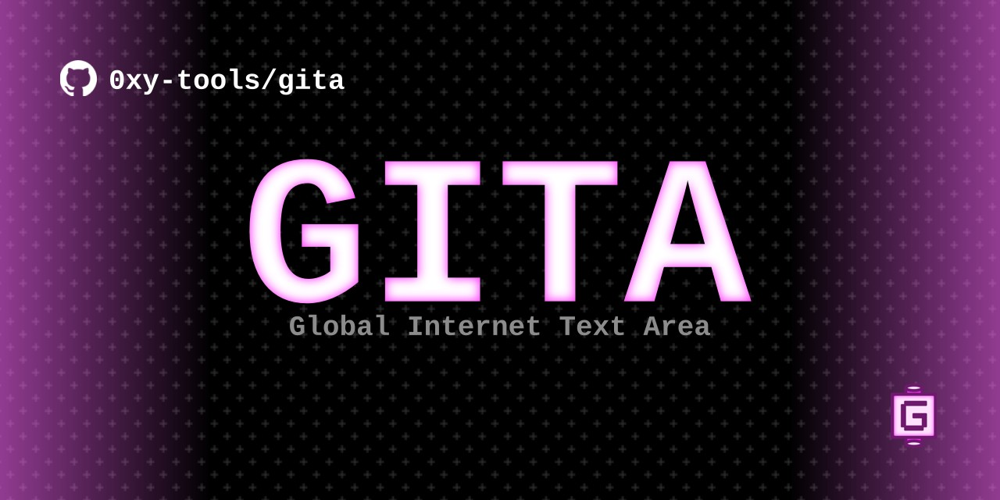
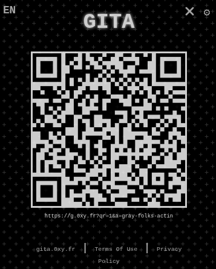

---
# GITA ? What is it ?
GITA is a tool that allows you to share text between your different devices continuously. Simple and fast to use, no sign-up or account is required.

## How to use it ?

You can simply go to [https://gita.0xy.fr](https://gita.0xy.fr), create an area and start sharing your text.

> [!NOTE]
> You can use the QRCode icon  to simply share your area on your smartphone by scanning a QRCode. 
> 
> 

## Create your own server

You will be able to get the server code here (php/sql) in order to create your own instance.